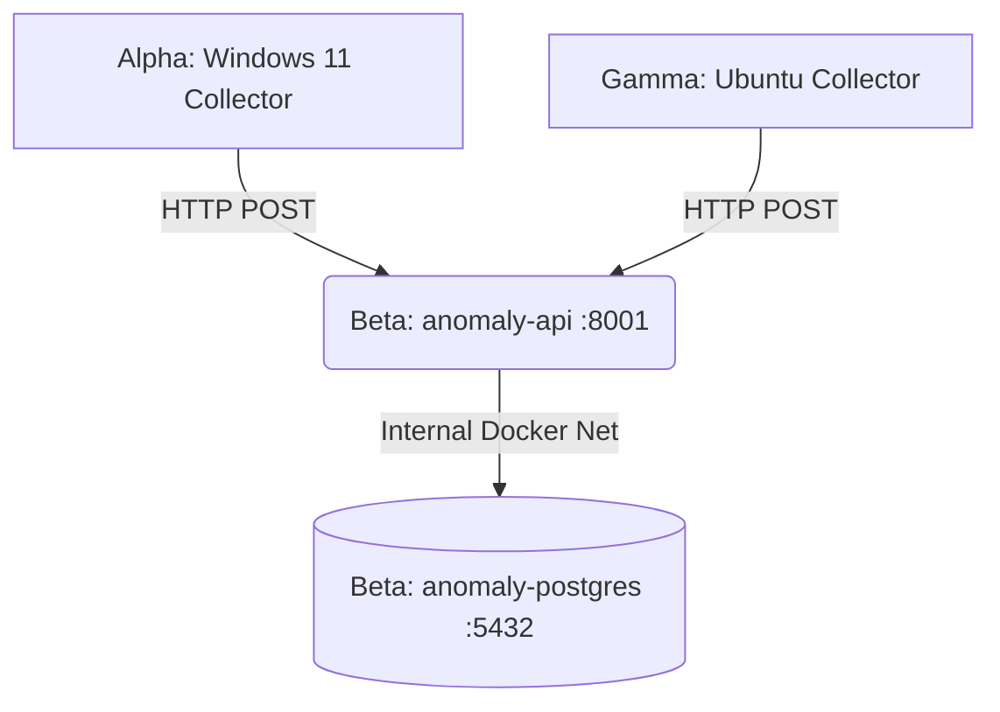

# Home Lab Anomaly / Observability Agent

A lightweight, local-first machine learning infrastructure observability system for a home lab environment.

## Project Purpose
To build a reliable telemetry ingestion and anomaly detection system for local infrastructure. The agent tracks key performance indicators across three nodes (Alpha, Beta, Gamma) operating on diverse hardware (Windows and Linux).

## Architecture



### Node Roles
*   **Alpha (Windows 11):** Primary development machine, ML training machine. Has an RTX 4060 GPU. The collector here runs natively using Windows components (psutil, nvidia-smi).
*   **Beta (Ubuntu 24.04):** Main home server and central ingestion node. Hosts the `anomaly-api` and `anomaly-postgres` Docker containers on the `anomaly-net` docker network.
*   **Gamma (Ubuntu 24.04):** Lightweight node running the python collector directly via systemd.

## Data Flow
1. Agents on each node collect metrics every 30 seconds using `psutil`.
2. Hardware constraints/missing metrics (e.g. Windows load averages) are passed as `null`.
3. Payload is serialized and sent to `POST /ingest` on the central Beta node.
4. The FastAPI backend validates the payload using Pydantic schemas.
5. Telemetry data is inserted into the `node_metrics` PostgreSQL table.

## Database Schema
The main table is `node_metrics` tracking timestamped metrics for each `node_id`.

```sql
CREATE TABLE node_metrics (
    id BIGINT PRIMARY KEY,
    node_id VARCHAR NOT NULL,
    ts TIMESTAMP WITH TIME ZONE NOT NULL,
    cpu_pct DOUBLE PRECISION,
    mem_pct DOUBLE PRECISION,
    swap_pct DOUBLE PRECISION,
    disk_read_bps DOUBLE PRECISION,
    disk_write_bps DOUBLE PRECISION,
    disk_used_pct DOUBLE PRECISION,
    net_in_bps DOUBLE PRECISION,
    net_out_bps DOUBLE PRECISION,
    load1 DOUBLE PRECISION,
    load5 DOUBLE PRECISION,
    load15 DOUBLE PRECISION,
    temp_c DOUBLE PRECISION,
    gpu_util_pct DOUBLE PRECISION,
    gpu_vram_pct DOUBLE PRECISION
);
CREATE INDEX idx_node_ts ON node_metrics (node_id, ts);
```

## API Endpoints
*   `GET /health`: Basic health check.
*   `POST /ingest`: Accepts JSON payloads containing the latest node metrics.
*   `GET /last_seen/{node_id}`: Returns the last received timestamp and online status of the given node (considered offline if no metrics received for >120s).

## Collector Configuration
Collectors use environment variables to configure their behavior:
*   `NODE_ID`: Unique node identifier (e.g., `alpha-win`).
*   `INGEST_URL`: Target endpoint (e.g., `http://192.168.1.50:8001/ingest`).
*   `COLLECT_INTERVAL`: Polling interval in seconds (default 30).
*   `HAS_GPU`: Enables GPU monitoring if `true` using pynvml.

## Local Development
Requires Python 3.13.
1. `pip install -r requirements.txt`
2. Run database: `docker compose up -d`
3. Run API: `uvicorn api.main:app --port 8001`
4. Run tests: `pytest tests/`

## Deployment

### Docker Deployment (Beta Node)
The server runs via Docker Compose on Beta, setting up the `anomaly-api` and `anomaly-postgres` services tightly coupled under the `anomaly-net` isolated network. `postgres` port 5432 is not bound to the host.
1. Configure `deploy/homelab-server.env`.
2. Enable `deploy/homelab-server.service` using systemd.

### Linux Deployment (Gamma Node)
1. Clone repo, setup python virtual environment.
2. Configure `deploy/homelab-collector.env`.
3. Enable `deploy/homelab-collector.service` using systemd.

### Windows Deployment (Alpha Node)
Alpha utilizes the Windows Task Scheduler or a Windows-native daemonization tool to run `python -m collector.agent` at boot.

## ML Methodology (Future Work)
This project is currently in the data collection phase (Milestones 1-8). 
Future ML implementation will utilize unsupervised anomaly detection (Isolation Forest) trained per-node on baseline metrics, progressing to robust alerting via Telegram. The Isolation forest will act as the lightweight real-time mechanism, while optional LSTM implementations might be considered later.
